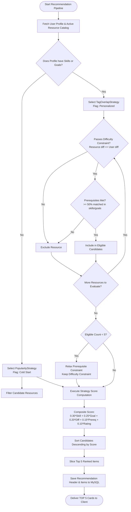

# Activity Diagram — Recommendation Engine Decision Flow

```mermaid
flowchart TD
    Start([Start Recommendation Pipeline]) --> LoadData[Fetch User Profile & Active Resource Catalog]
    LoadData --> CheckProfile{Does Profile have Skills or Goals?}
    
    CheckProfile -- No --> SetColdStart[Select PopularityStrategy<br/>Flag: Cold Start]
    CheckProfile -- Yes --> SetPersonalized[Select TagOverlapStrategy<br/>Flag: Personalized]
    
    SetColdStart --> IterateResources[Filter Candidate Resources]
    SetPersonalized --> DifficultyFilter{Passes Difficulty Constraint?<br/>Resource diff <= User diff}
    
    DifficultyFilter -- No --> ExcludeResource[Exclude Resource]
    DifficultyFilter -- Yes --> PrereqCheck{Prerequisites Met?<br/>>= 50% matched in skills/goals}
    
    PrereqCheck -- No --> ExcludeResource
    PrereqCheck -- Yes --> IncludeResource[Include in Eligible Candidates]
    
    IncludeResource --> CheckMoreCandidates{More Resources to Evaluate?}
    ExcludeResource --> CheckMoreCandidates
    CheckMoreCandidates -- Yes --> DifficultyFilter
    CheckMoreCandidates -- No --> CheckCount{Eligible Count < 5?}
    
    CheckCount -- Yes --> RelaxPrereqs[Relax Prerequisite Constraint<br/>Keep Difficulty Constraint]
    RelaxPrereqs --> ScoreResources[Execute Strategy Score Computation]
    CheckCount -- No --> ScoreResources
    SetColdStart --> ScoreResources
    
    ScoreResources --> CalcFormula["Composite Score:<br/>0.30*Skill + 0.25*Goal + 0.20*Diff + 0.15*Prereq + 0.10*Rating"]
    CalcFormula --> SortList[Sort Candidates Descending by Score]
    SortList --> SliceTop5[Slice Top 5 Ranked Items]
    SliceTop5 --> PersistDB[Save Recommendation Header & Items to MySQL]
    PersistDB --> ReturnResponse([Deliver TOP 5 Cards to Client])
```
