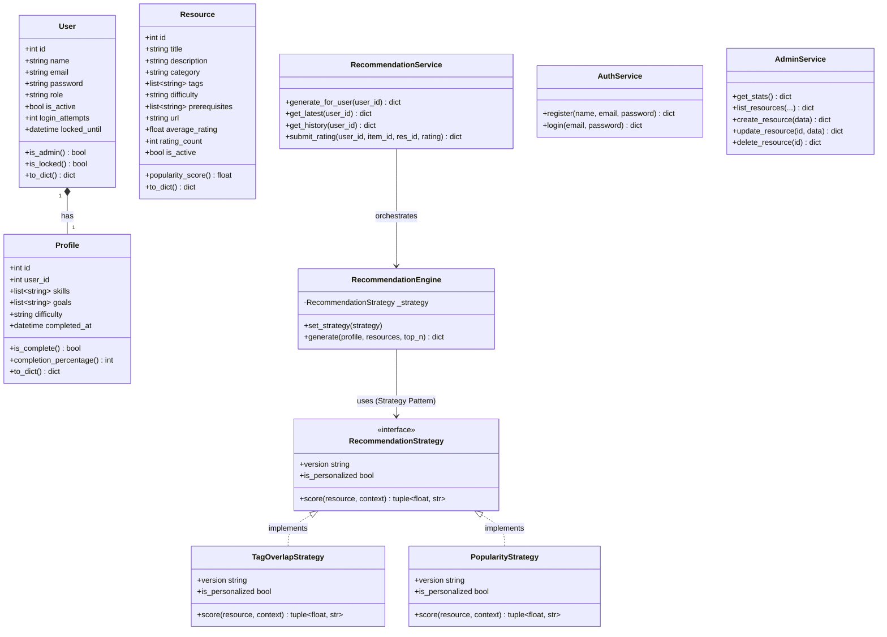

# Class Diagram (Domain, Services, Strategies, Repositories)

```mermaid
classDiagram
    direction TB

    class User {
        +int id
        +string name
        +string email
        +string password
        +string role
        +bool is_active
        +int login_attempts
        +datetime locked_until
        +is_admin() bool
        +is_locked() bool
        +to_dict() dict
    }

    class Profile {
        +int id
        +int user_id
        +list~string~ skills
        +list~string~ goals
        +string difficulty
        +datetime completed_at
        +is_complete() bool
        +completion_percentage() int
        +to_dict() dict
    }

    class Resource {
        +int id
        +string title
        +string description
        +string category
        +list~string~ tags
        +string difficulty
        +list~string~ prerequisites
        +string url
        +float average_rating
        +int rating_count
        +bool is_active
        +popularity_score() float
        +to_dict() dict
    }

    class RecommendationStrategy {
        <<interface>>
        +score(resource, context) tuple~float, str~
        +version string
        +is_personalized bool
    }

    class TagOverlapStrategy {
        +score(resource, context) tuple~float, str~
        +version string
        +is_personalized bool
    }

    class PopularityStrategy {
        +score(resource, context) tuple~float, str~
        +version string
        +is_personalized bool
    }

    class RecommendationEngine {
        -RecommendationStrategy _strategy
        +set_strategy(strategy)
        +generate(profile, resources, top_n) dict
    }

    class RecommendationService {
        +generate_for_user(user_id) dict
        +get_latest(user_id) dict
        +get_history(user_id) dict
        +submit_rating(user_id, item_id, res_id, rating) dict
    }

    class AuthService {
        +register(name, email, password) dict
        +login(email, password) dict
    }

    class AdminService {
        +get_stats() dict
        +list_resources(...) dict
        +create_resource(data) dict
        +update_resource(id, data) dict
        +delete_resource(id) dict
    }

    RecommendationStrategy <|.. TagOverlapStrategy : implements
    RecommendationStrategy <|.. PopularityStrategy : implements
    RecommendationEngine --> RecommendationStrategy : uses (Strategy Pattern)
    RecommendationService --> RecommendationEngine : orchestrates
    User "1" *-- "1" Profile : has
```
