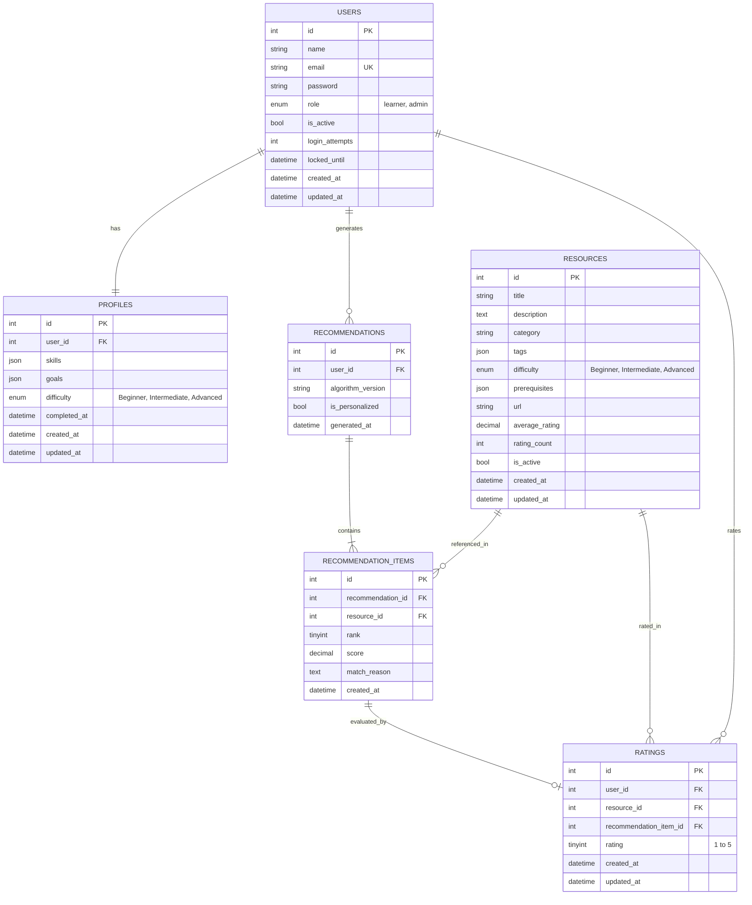

# Entity-Relationship (ER) Diagram

```mermaid
erDiagram
    USERS ||--|| PROFILES : "has"
    USERS ||--o{ RECOMMENDATIONS : "generates"
    USERS ||--o{ RATINGS : "rates"
    RECOMMENDATIONS ||--|{ RECOMMENDATION_ITEMS : "contains"
    RESOURCES ||--o{ RECOMMENDATION_ITEMS : "referenced_in"
    RESOURCES ||--o{ RATINGS : "rated_in"
    RECOMMENDATION_ITEMS ||--o| RATINGS : "evaluated_by"

    USERS {
        int id PK
        string name
        string email UK
        string password
        enum role "learner, admin"
        bool is_active
        int login_attempts
        datetime locked_until
        datetime created_at
        datetime updated_at
    }

    PROFILES {
        int id PK
        int user_id FK
        json skills
        json goals
        enum difficulty "Beginner, Intermediate, Advanced"
        datetime completed_at
        datetime created_at
        datetime updated_at
    }

    RESOURCES {
        int id PK
        string title
        text description
        string category
        json tags
        enum difficulty "Beginner, Intermediate, Advanced"
        json prerequisites
        string url
        decimal average_rating
        int rating_count
        bool is_active
        datetime created_at
        datetime updated_at
    }

    RECOMMENDATIONS {
        int id PK
        int user_id FK
        string algorithm_version
        bool is_personalized
        datetime generated_at
    }

    RECOMMENDATION_ITEMS {
        int id PK
        int recommendation_id FK
        int resource_id FK
        tinyint rank
        decimal score
        text match_reason
        datetime created_at
    }

    RATINGS {
        int id PK
        int user_id FK
        int resource_id FK
        int recommendation_item_id FK
        tinyint rating "1 to 5"
        datetime created_at
        datetime updated_at
    }
```
