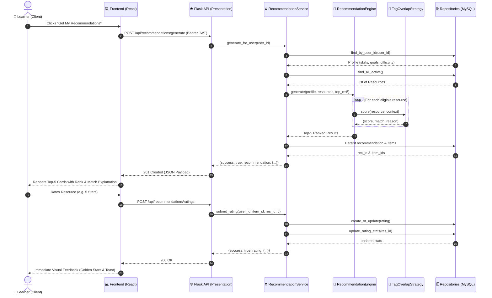

# Sequence Diagram — Recommendation Generation & Feedback Loop

```mermaid
sequenceDiagram
    autonumber
    actor Learner as 👤 Learner (Client)
    participant UI as 💻 Frontend (React)
    participant API as 🌐 Flask API (Presentation)
    participant RS as ⚙️ RecommendationService
    participant RE as 🧠 RecommendationEngine
    participant Strat as 🎯 TagOverlapStrategy
    participant Repo as 🗄️ Repositories (MySQL)

    Learner->>UI: Clicks "Get My Recommendations"
    UI->>API: POST /api/recommendations/generate (Bearer JWT)
    API->>RS: generate_for_user(user_id)
    RS->>Repo: find_by_user_id(user_id)
    Repo-->>RS: Profile (skills, goals, difficulty)
    RS->>Repo: find_all_active()
    Repo-->>RS: List of Resources
    RS->>RE: generate(profile, resources, top_n=5)
    
    loop For each eligible resource
        RE->>Strat: score(resource, context)
        Strat-->>RE: (score, match_reason)
    end
    
    RE-->>RS: Top-5 Ranked Results
    RS->>Repo: Persist recommendation & items
    Repo-->>RS: rec_id & item_ids
    RS-->>API: {success: true, recommendation: {...}}
    API-->>UI: 201 Created (JSON Payload)
    UI-->>Learner: Renders Top-5 Cards with Rank & Match Explanation

    Learner->>UI: Rates Resource (e.g. 5 Stars)
    UI->>API: POST /api/recommendations/ratings
    API->>RS: submit_rating(user_id, item_id, res_id, 5)
    RS->>Repo: create_or_update(rating)
    RS->>Repo: update_rating_stats(res_id)
    Repo-->>RS: updated stats
    RS-->>API: {success: true, rating: {...}}
    API-->>UI: 200 OK
    UI-->>Learner: Immediate Visual Feedback (Golden Stars & Toast)
```
