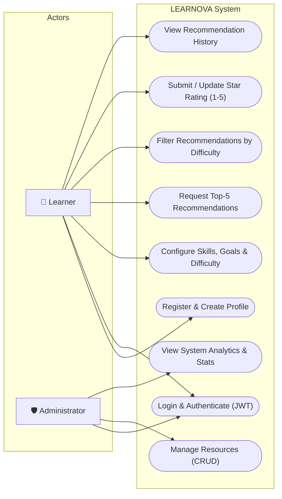

# Use Case Diagram

```mermaid
flowchart LR
    subgraph Actors
        Learner["👤 Learner"]
        Admin["🛡️ Administrator"]
    end

    subgraph LearnovaSystem["LEARNOVA System"]
        UC1(["Register & Create Profile"])
        UC2(["Login & Authenticate (JWT)"])
        UC3(["Configure Skills, Goals & Difficulty"])
        UC4(["Request Top-5 Recommendations"])
        UC5(["Filter Recommendations by Difficulty"])
        UC6(["Submit / Update Star Rating (1-5)"])
        UC7(["View Recommendation History"])
        UC8(["Manage Resources (CRUD)"])
        UC9(["View System Analytics & Stats"])
    end

    Learner --> UC1
    Learner --> UC2
    Learner --> UC3
    Learner --> UC4
    Learner --> UC5
    Learner --> UC6
    Learner --> UC7

    Admin --> UC2
    Admin --> UC8
    Admin --> UC9
```
